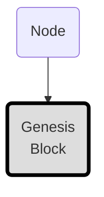
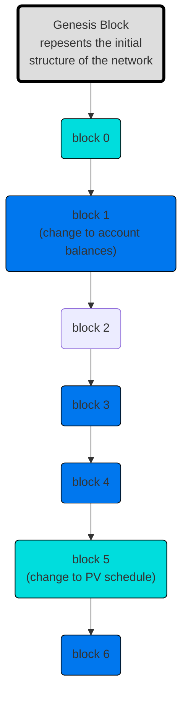

# Blocks (mermaid)

The network is initialized from a single node and a **genesis block**. This is the very first block in the blockchain which defines the initial structure of the network.

The genesis block consists of the minimum amount of information required to initialize a new network including:

* All account information from alpha
* The node registration of the source node
* The initial schedule consisting a single node (the source node)

| Genesis Block      |
|--------------------|
| All Alpha Accounts <table><tr><td>✓ -----</td></tr><tr><td>✓ -----</td></tr><tr><td>✓ -----</td></tr></table> |
| Node Registration <== Node |
| Schedule <table><tr><td>1. Node A</td></tr><tr><td>2. Node B</td></tr><tr><td>...</td></tr></table>          |

Blocks are data structures that represent a description of change to the network. These originate from signed requests and may include:

* a transfer of coins between accounts
* the registration of a username
* a new node being added to the network
* etc...

> ⓘ Note
> For details on all the different block types, see the [Block Types](https://www.thenewboston.com/guide/block-types) section of the documentation.
